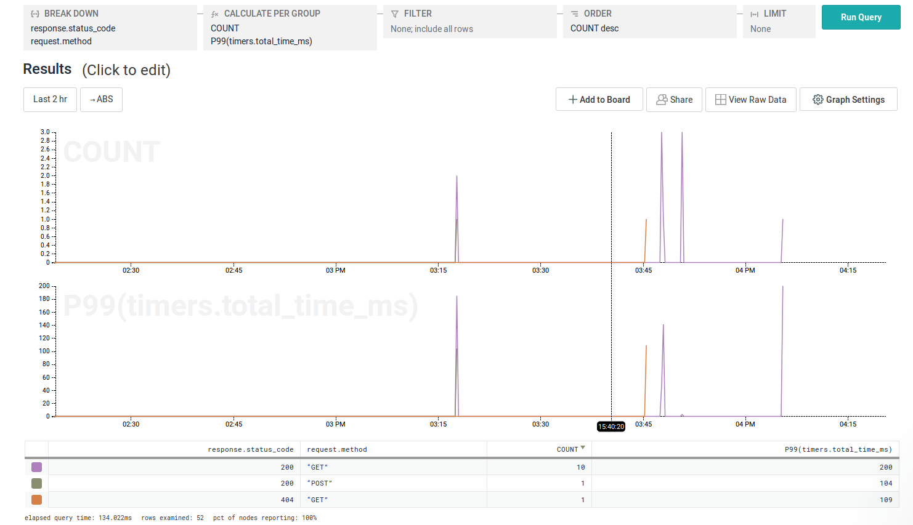

# libhoney-java-example-webapp

This application demonstrates a simple Honeycomb instrumentation of 
a [Spring Boot](https://projects.spring.io/spring-boot/) application. It is CRUD interface for managing a TODOs list.
The backend is an in-memory [H2 database](http://www.h2database.com/html/main.html).

Events are created per-HTTP-request (following the Honeycomb one event per unit of work model) using a Spring 
[Handler 
Interceptor](/src/main/java/io/honeycomb/libhoney/example/webapp/instrumentation/HoneycombHandlerInterceptor.java) to
capture request/response data and use the libhoney-java SDK to send events to HoneyComb. A 
[request context](src/main/java/io/honeycomb/libhoney/example/webapp/instrumentation/HoneycombContext.java) is
propagated throughout the app (using Spring's 
[request scope](https://docs.spring.io/spring-framework/docs/current/javadoc-api/org/springframework/web/context/annotation/RequestScope.html)) 
allowing other parts of the request processing to be instrumented. Calls to the SQL backend are 
instrumented as an example. This is a straightforward approach to context propagation which you can enhance using other 
parts of the Spring framework. For example, the Spring Data repository calls could be instrumented using AOP (as in
[this example](https://github.com/spring-projects/spring-data-examples/tree/master/jpa/interceptors/src/main/java/example/springdata/jpa/interceptors) 
given by Spring).

## Run locally

### Required configuration

Set your HoneyComb write key and the dataset you want to report to by using the 
[application.properties](src/main/resources/application.properties) file. 

This application requires Java 8.

### Run commands

Run the application using the maven wrapper as follows:
```sh
./mvnw install && ./mvnw spring-boot:run -pl io.honeycomb.examples:libhoney-java-example-webapp
```
Alternatively, you can build an executable jar in the module target directory using:
 ```sh
 ./mvnw package
 ```

### Global fields

You can set other 'global' SDK properties in 
the [application.properties](src/main/resources/application.properties)
file, including setting any 'global fields'. These are fields that will be included in any event 
sent (unless overridden at a more specific scope, e.g. the event level). See the SDK documentation for more detail 
on how 'global fields' are resolved. 

The default configuration adds two global fields as follows:
 ```
honeycomb.global-fields.app.name: example-web-app
honeycomb.global-fields.app.region: us-west-1
```
This creates these global fields:
 ```
app.name: example-web-app
app.region: us-west-1
```

### Response Observer

A simple [Response Observer](src/main/java/io/honeycomb/libhoney/example/webapp/LoggingResponseObserver.java) is 
registered with the HoneyComb SDK. This logs into the console a response to each HoneyComb event submitted to the SDK. 
A more mature application might monitor/alert on these responses in order to ensure that the HoneyComb integration is 
working well.

## API

A basic REST API for todos is exposed on port 8080 (see the 
[application.properties](src/main/resources/application.properties) if you would like to override this):

```sh
$ curl \
    -H 'Content-Type: application/json' \
    -X POST -d '{"description": "Walk the dog", "due": 1518816723}' \
    localhost:8080/todos/
...

$ curl localhost:8080/todos/
[
  {
    "completed": false,
    "description": "Walk the dog",
    "due": "Fri, 16 Feb 2018 21:32:03 GMT",
    "id": 1
  }
]

$ curl -X PUT \
    -H 'Content-Type: application/json' \
    -d '{"description": "Walk the cat"}' \
    localhost:8080/todos/1/
{
  "completed": false,
  "description": "Walk the cat",
  "due": "Fri, 16 Feb 2018 21:32:03 GMT",
  "id": 1
}

$ curl -X DELETE localhost:8080/todos/1/
{
  "id": 1,
  "success": true
}

$ curl localhost:8080/todos/
[]
```

## Event fields

The following fields will be sent to HoneyComb:

| **Name** | **Description** | **Example Value** |
| --- | --- | --- |
| `errors.message` | Message in the error encountered, if applicable | `undefined` |
| `request.method` | HTTP method | `POST` |
| `request.path` | Request path | `/todos` |
| `request.user_agent.browser` | Web browser the request was served to | `chrome` |
| `request.user_agent.platform` | OS of the user agent | `macos` |
| `request.user_agent.string` | Literal user agent string | `curl/7.54.0` |
| `request.user_agent.version` | Version of the user agent | `64.0.3282.186` |
| `response.status_code` | HTTP status code of the response | 404 |
| `timers.db.delete_todo` | Time in milliseconds for DB call to delete a todo | 23 |
| `timers.db.insert_todo_ms` | Time in milliseconds for DB call to insert a todo | 50 |
| `timers.db.select_all_todos` | Time in millisconds for DB call to select all todos | 11 |
| `timers.db.update_todo` | Time in milliseconds for DB call to update a todo | 50 |
| `timers.total_time_ms` | Total time in milliseconds spent serving the request | 75 |
| `app.name` | An example global field | example-web-app |
| `app.region` | Another example global field | us-west-1 |

## Example Query In the Honeycomb UI


